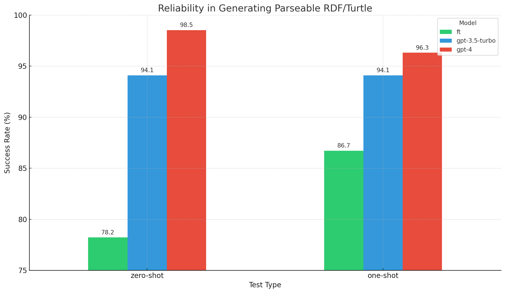
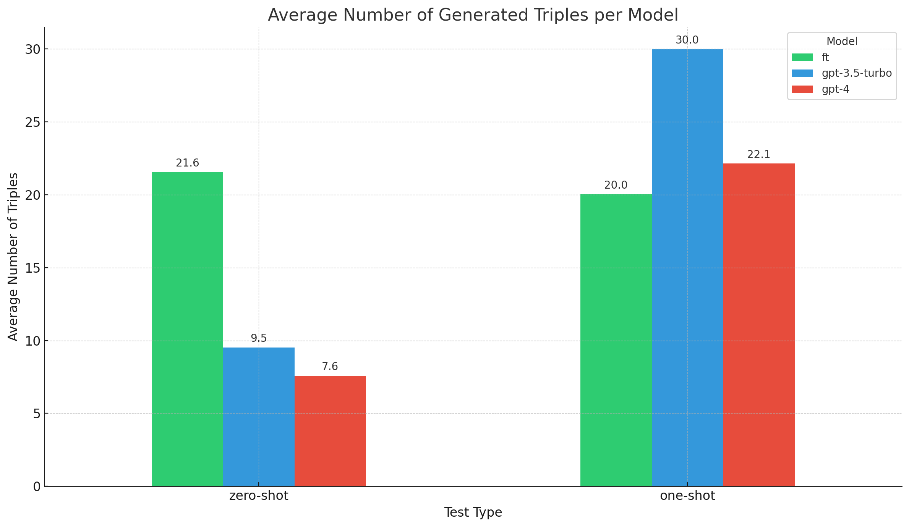
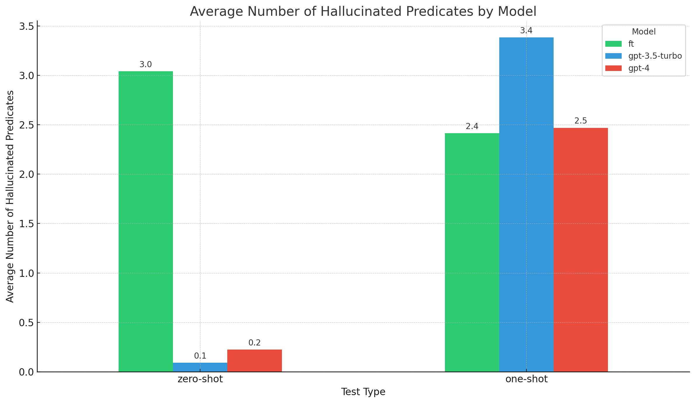

# An experiment in fine-tuning OpenAI with RDF
For a long time I wasn't particularly interested in large language
models. They seemed unreliable and incapable of generating structured
data to query in the context of real-world tasks. While many view them
as a search engine of sorts I always felt they were more interesting
as conversational interfaces capable of extracting web-scale
patterns--though pessimisitic that such data that could ever enrich
knowledge graphs. Until ChatGPT was invented I basically ignored the
field. That was a mistake.

Over the past year, I've delved into OpenAI's capabilities. I wanted
to assess how current models fare on tasks that are challenging and
obscure. Furthermore, I wanted to assess the results of an experiment
quantitatively while also being able to provide a subjective analysis
on the quality of the output, hallucinations included. 

Disclaimer: I'm not a scientist and these are not scientific
results. This is an exploratory experiment and I just want to report
the findings, as I find them interesting, and perhaps others will
too. I did try to design the experiment in a way where I sampled
each model enough times for each test to be interesting
statistically. That being said, I'm sure I got a lot wrong. Please
forgive my mistakes as I learn! Read on to probe the depths of my
ignorance. If you are a data scientist interested in helping me
interpret these kind of results, please reach out.

## Background
There are many enterprise knowledge graphs bursting at the seams with
information. Generally speaking accumulating knowledge is not
difficult. Making that knowledge queryable and useful for downstream
applications at scale is the real challenge, similar to any large-scale
search application. I wondered, if these large language models
are being trained on the web, how much of that training taught it to
appreciate RDF? After all Wikidata and Dbpedia are both available as
structured RDF datasets so there is a lot out there that was
potentially seen during training. Is it possible any of that knowledge
has been generalized in the base models? If so, how do I even go about
testing that?

## Designing the Experiment
Frankly, I'm not sure how to best design an experiment like this, and
certainly not on a large language model. So I did what humans do best:
I made up some tests based on my intuition. The starting point was a
prompt consistent across all examples, balancing the need for
generating parseable structured data and creativity.

The system message read: "You are an RDF Turtle generator and creative
wizard of the metaobject protocol on the Semantic Web. Your task is to
materialize RDF Turtle for a single resource at a time, based on the
prefixes provided by the user. Employ these prefixes to craft valid
RDF Turtle descriptions of the requested resources for the user,
weaving in relevant relationships, properties, and its semantics using
OWL, the Web Ontology Language. Ensure that when your response is
concatenated with the provided prefixes, it forms syntactically
correct RDF Turtle that can be successfully parsed. While your
creativity is valued, ensure you do not include predicates you do not
fully understand in your responses, or repeat prefixes, or stray from
RDF Turtle. No markdown or explanatory text should be included in your
responses."

### Creating the fine-tuning dataset
Knowledge graphs, particularly expert-engineered ones like D3FEND and the Financial Industry Business Ontology (FIBO), deeply fascinate me. The idea of fine-tuning a language model with an OWL ontology so that the ontology's semantics become embedded into the model is highly motivating. For this experiment, I chose D3FEND as the starting point. The problem is, this is an unsolved problem, so there's not exactly a standard way of going about this. I wondered, could fine-tuning on the ontology improve the quality of structured responses generated by OpenAI's models?

Given the difficulty of translating expert knowledge into machine-readable and machine-reasonable semantics having a LLM assistant for these tasks with somewhat reliable and crucially insightful knowledge could be a game changer for many enterprise applications where explainability and integration into existing data pipelines is key.

Using the [Universal Translator](https://github.com/aamedina/rdf) with [Asami](https://github.com/quoll/asami), I loaded the D3FEND dataset and queried for all named resources with a namespace of 'd3f'. This provided the knowledge graph used for the fine-tune.

Using the [Donatello library](https://github.com/quoll/donatello), each resource was written as an example in the dataset. This code made it easy to generate our training and evaluation datasets. In total, there were 3483 examples in the training file and 271 examples per evaluation.

Each example simulated a conversation between a user and an assistant. The system message set the task. The first user message introduced the Turtle prefixes. The second specified a resource's qname in D3FEND. The assistant's response was the Turtle representation of that resource, complete with materialized metaobject protocol (MOP) inferences. While not evaluated in this report, observing the model's creative use of MOP in an RDF/OWL context could be insightful for future experiments on this fine-tuning.

### Evaluation
After fine-tuning I wanted to compare the model on the same task with gpt-3.5-turbo and gpt-4. To do so I decided to try two tests: one with no examples (zero-shot) and one with a single example (one-shot).

Both tests employed the same system message from the fine-tuning dataset, followed by Turtle prefixes (minus the MOP prefix). The zero-shot test was label-centric, focusing on a concept from the D3FEND matrix. Conversely, the one-shot test provided a comprehensive example.

#### A Costly Mistake
An initial oversight in the one-shot test was the inclusion of metaobject prefixes. Since I omitted MOP from the example's prefixes, the model's performance plummeted. Recognizing this error, I reran the test, leading to more logical data. This highlighted the importance of consistency in prompts. LLMs, it seems, take instructions quite literally. I've included the mistake in the appendix alongside the corrected evals and code used to generate the datasets.

## Results and Analysis
Now the time has come to figure out what we have learned (if anything!).

Let's walk through each of these figures and I'll share my observations about them.

### Reliability in Generating Parseable RDF/Turtle

This chart illustrates the success rate on the y-axis in generating parseable RDF/Turtle data, with the x-axis representing the test types (one-shot and zero-shot) and each bar representing a model.

#### Observations
* For the zero-shot test, the GPT-4 model has the highest success rate, followed closely by GPT-3.5-turbo. The fine-tuned model lags behind both base models.

* For the one-shot test, GPT-4 still leads, but the gap between it and GPT-3.5-turbo narrows slightly. The fine-tuned model improves its performance compared to the zero-shot scenario but remains behind the base models.

### Average Number of Triples Generated per Model

This chart shows the average number of triples on the y-axis generated by each model on each test, with the same x-axis as before.

#### Observations
* For the zero-shot test, the fine-tuned (ft) is by far the most prolific, producing the most triples on average at approximately 21.57 triples per sample. GPT-3.5-turbo and GPT-4 are a lot more conservative, generating between 7.59 and 9.52 on average respectively.
* For the one-shot test, GPT-3.5-turbo produces the most triples with an average of 30.01 triples per sample. This indicates that providing an example noticeably boosts its confidence in generating more triples. GPT-4, while still conservative, increases its output to an average of 22.14 triples per query. The fine-tuned model generates slightly fewer triples in this test but is likely not statistically significant difference.

### Average Number of Hallucinated Predicates per Model

This chart presents the average number of hallucinated predicates generated by each model in different test scenarios.

#### Observations
* For the zero-shot test, the fine-tuned model has the most hallucinations because it is also generating the most triples. Generally speaking, the more creative the less accurate the model is. Both GPT-3.5 and GPT-4 hallucinated much less because they generated fewer triples on average.
* For the one-shot test, both the fine-tuned model and GPT-4 hallucinate on average about the same. GPT-3.5 is the worst performer on this metric.

### Subjective Analysis
Beyond the quantitative results, which are only so informative on such an obscure task, I wanted to provide a personal interpretation of its hallucinations, considering aspects like creativity, common sense, and potential utility for an expert interacting with a language model.

#### Fine-tuned
##### Zero shot
Though not as reliable as the base models, the fine-tuned model exhibited a stronger inclination to use D3FEND predicates in both tests. This suggests to me that the fine-tuning data had a discernible influence, but not necessarily a good one. Naturally, this also led to an increase in hallucinations. While I admired its creativity and occasional coherence, its accuracy wasn't great, especially when it generated more facts. Given that it had exposure to the entire D3FEND dataset during fine-tuning, its inability to replicate any of them accurately was a bit disappointing. I do wonder how GPT-4 fine tuning would fare, but shudder at the costs!

##### One shot
Presenting the model with a single example improved its success rate. Notably odd uses of the D3FEND annotation property d3f:display-order, which is used for UI display sequence on the D3FEND website, hinted at the model's mimicry from its training rather than genuine comprehension. Nonetheless, in some instances, like with the concept for d3f:Isolate, the model demonstrated a semblance of understanding the tactic.

#### gpt-3.5-turbo
##### Zero shot
The model's performance exceeded my initial expectations. It frequently generated parseable RDF Turtle, with its hallucinations often appearing plausible. I discerned a conservative trend in the responses. This could be attributed to my instruction against using unfamiliar properties. Consequently, its lower hallucination rate might result from its restraint in employing D3FEND. Overall, I found gpt-3.5-turbo's results suitable in structuring concepts using RDF, RDFS, OWL, DCTERMS, and SKOS.

##### One shot
Armed with a single example, the model seemed more confident and ventured into using D3FEND predicates. This newfound confidence, however, led to increased hallucinations. For instance, when queried about d3f:Model, the model misconstrued it as a computer model rather than the intended defensive tactic.

#### gpt-4
##### Zero shot
Interestingly the results from GPT-4 were not very different in my subjective analysis from gpt-3.5-turbo. It basically does the same thing by using well known predicates and classes from the RDF ecosystem, limiting its hallucinations to object references. In terms of reliability, it is the best of the three models. GPT-4 is good at following weird instructions as long as they are expressed coherently and consistently in context.

##### One shot
My initial reactions to GPT-4's one-shot results were mixed. While I anticipated a marked enhancement in output quality upon providing an example, the improvements seemed marginal. However, a deeper dive into the samples revealed a pattern of consistent, albeit imperfect, structured data. Balancing the costs and benefits of utilizing GPT-4 will undoubtedly vary depending on individual use-cases.

As an additional sanity check, I utilized Qdrant for embedding searches. Using text-embedding-ada-002, I embedded the model's output and matched it against the vectors of D3FEND concepts to find the closest matches. Occasionally, its hallucinated output closely aligned with the original concept in the embedding space. Evidently, GPT-4 fared better with higher-tier cybersecurity concepts, rendering it more adept for this task compared to gpt-3.5-turbo at a much higher cost.

## Conclusion
This crude experiment explored the potential of fine-tuning language models with RDF data. While much of the resulting Turtle that attempted to use D3FEND predicates was hallucinated, the models demonstrated a subjectively strong capability to generate RDF that seems plausible at times and even creative. I do think that with a human in-the-loop the language models can provide valuable insights to experts, but the plausibility of the hallucinations could confuse or mislead those unfamiliar with RDF.

I think if I were to run this experiment again I would use JSON-LD instead of Turtle in the prompt. I would like to see to what extent that would improve the performance on this task on the base models, given that there is support in gpt-3.5-turbo and gpt-4 (but not the fine tuned models) to generate JSON arguments for "function calling" following a JSON Schema.
